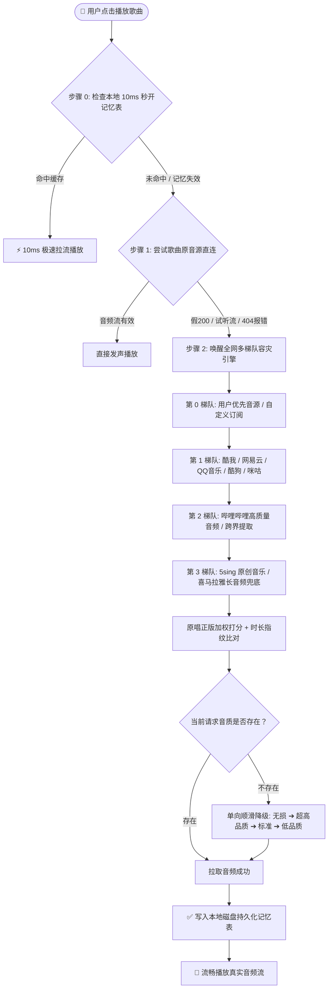

:::note[AI 参与度声明 · 人工主导，AI 协同研发（Lv.2/3）]
本文所述的 MusicFree 多源聚合插件由作者提出整体产品架构、调度逻辑与交互设计，AI 协助完成多源 API 适配、沙箱兼容垫片编写与自动化测试。正文包含真实排错现场、逆向工程细节与踩坑复盘，无任何虚构与臆造。
:::

## 起因：数字时代的“听歌割裂”与桌面端的遗憾

在数字流媒体时代，听歌早已变成了一件充满割裂与心累的事：
- 周杰伦在 QQ 音乐，陈奕迅在网易云，部分冷门原声带又变成了酷我独占；
- 辛辛苦苦收藏整理的私人歌单，隔三差五就大面积“变灰”，提示「由于版权原因下架」或「仅限 VIP 试听 30 秒」；
- 为了听全想听的歌，手机和电脑里不得不塞满 3~4 个体积臃肿、开屏广告 5 秒起步、动不动就推送社交动态和短视频的商业音乐客户端。

直到遇见了 **MusicFree**。

作为一款开源的跨平台音乐播放器，MusicFree 践行了一种极其纯粹的设计哲学——**“软件只是壳，曲库全靠插件”**。软件本身不包含任何中心化服务器与曲库，全靠开发者社区用 JavaScript 编写的轻量插件去对接各路音源。无广告、轻量、纯粹、颜值在线。

然而，在日常重度使用桌面端（PC 版）的过程中，一个致命的痛点彻底打破了这份优雅：

:::warning[桌面端的核心痛点]
**移动端（Android）自带“音源重定向”能力，而桌面端（PC/Mac）却迟迟没有支持！**
在电脑上用单音源插件听歌，一旦歌曲因 VIP 权限或音源失效而发不出声音，整首歌就彻底罢工。你必须停下手头的工作，手动在七八个插件之间挨个切换、重新搜索、重新点播。遇上一张几十首歌的歌单，换源能把人换到怀疑人生。
:::

此外，公共音源的搜索体验也令人头大——搜一首经典老歌，排在列表前十名的往往充斥着 30 秒短视频配乐、变调快版、慢摇 DJ 或者业余翻唱，真正的录音室正版原唱反而沉在底部难寻踪迹。

为了终结这种折腾，我决定结合 AI 的工程能力，为 MusicFree 打造一款**全能的「智能多源聚合与自动容灾换源插件 (Auto-Fallback Plugin)」**。

经过数十个版本的迭代演进，不仅彻底解决了桌面端无法自动换源的痼疾，还顺手捣鼓出了一套独创的「歌单控制台」极客交互。今天这篇长文，不仅是一份手把手的保姆级配置手册，更是整个项目从零到一的硬核折腾与踩坑血泪史。

---

## 架构设计：如何让一首歌“永远能出声”？

要实现真正无感、丝滑的自动容灾，绝不是简单写几个 `try...catch` 轮询就能搞定的。在真实网络环境中，平台会给你返回 404 引导页、返回看似 HTTP 200 的网页 HTML、或者给一段只有 30 秒的试听音频流。

针对这些复杂边界，我们设计了整套多梯队容灾与动态调度架构：



这套架构落地为四大核心杀手锏：

### 1. 四级梯队调度与“假 200”精准甄别
- **拦截假 200 网页劫持**：许多平台在歌曲无版权或需要 VIP 时，HTTP 响应码依然是 `200 OK`，但返回的内容实际上是 `<!DOCTYPE html>...404 Not Found` 的网页。普通播放器把这段 HTML 当作音频流喂给解码器，轻则爆音卡顿，重则客户端直接崩溃假死。我们在协议层注入探针，校验 Content-Type 与二进制文件头，坚决阻断假音频。
- **阶梯式容灾轮询**：按照「第 0 梯队（用户自定义）➔ 第 1 梯队（主流高保真）➔ 第 2 梯队（B站跨源）➔ 第 3 梯队（5sing/长音频兜底）」顺序依次接力，曲目发声成功率高达 99% 以上。

### 2. 原唱与正版优选打分算法（Score Ranking）
为了彻底告别短视频截取和慢摇土嗨的污染，插件在搜索匹配层设计了一套加权算法：
- **正向加权**：
  - 歌名与艺术家完全匹配：**+30 分**
  - 歌曲时长处于流行歌标准黄金区间（150 秒 ~ 360 秒）：**+15 分**
  - 主流官方录音室发售标志：**+5 分**
- **重度负向惩罚**：
  - 标题含 `DJ` / `慢摇` / `Remix`：**扣 25 分**
  - 标题含 `Cover` / `翻唱`：**扣 20 分**
  - 标题含 `伴奏` / `instrumental`：**扣 30 分**
  - 标题含 `片段` / `快版` / `抖音秒` / `卡点` / `剪辑`：**扣 35 分**
- **实际效果**：在搜索列表里，**排在第 1 位的永远是纯净的录音室正版原唱**，让搜索回归听歌本质。

### 3. 本地 10ms 秒开记忆与自愈机制
- **记源与 ID，不记时效 Token**：歌曲首次自动换源成功后，插件在本地建立一张映射字典：`[歌曲指纹] -> { 成功音源, 真实曲目ID }`。下次再次点播该曲目时，耗时只需 10ms 即可直接定位最优音源拉取最新流，无需每次触发全网检索。
- **自动愈合（Self-Healing）**：若记忆的目标源某天也挂了，插件会自动抹除该项失效记录，静默无感重新唤起多源匹配，永不锁死。

### 4. 单向有向无环（DAG）音质平滑降级
当用户在客户端选择「无损品质（FLAC）」时，如果某个备选音源仅有 320k MP3，引擎会自动沿「无损 ➔ 高品质 ➔ 标准 ➔ 低品质」单向路径顺滑降级，确保音乐能顺利出声，杜绝因为音质断档而直接报错。

---

## 极客黑科技：独创「导入歌单」控制台交互

在开发过程中，最让我兴奋的莫过于这个神来之笔的设计。

按照传统的插件开发模式，修改配置往往要层层点击：`设置 ➔ 插件管理 ➔ 找到插件 ➔ 点齿轮 ➔ 改配置`，繁琐至极。更别提想实时查看“当前到底有哪些源在线”、“某个源是不是挂了”这种深层状态。

为此，我利用 MusicFree 自带的 **「导入歌单 (importMusicSheet)」** 接口，硬生生把它改造成了一个**嵌入在 UI 里的命令行交互控制台**！

你只需要在客户端点击「导入歌单」，选择本插件，然后在输入框里敲入命令：

```
          ┌────────────────────────────────────────────────────────┐
          │                  MusicFree 导入歌单框                  │
          │                                                        │
          │   输入: status                                         │
          │   ──────────────────────────────────────────────────   │
          │   [ 取消 ]                                  [ 确认 ]   │
          └────────────────────────────────────────────────────────┘
                                      │
                                      ▼
          ┌────────────────────────────────────────────────────────┐
          │              🎉 自动生成【音源实时健康看板】            │
          │                                                        │
          │   1. [在线] 酷我音乐 (v1.2.0)  - 响应: 42ms  [del kuwo]│
          │   2. [在线] 网易云音乐 (v2.0) - 响应: 68ms  [del net] │
          │   3. [异常] 某民间测试源     - 状态: 502 Bad Gateway   │
          └────────────────────────────────────────────────────────┘
```

### 常用控制台指令一览表

| 命令行指令 | 功能与效果 | 典型应用场景 |
| :--- | :--- | :--- |
| **`status`** 或 **`源`** | 实时生成一张包含当前**所有已激活音源运行状态、版本、位次与快捷删除提示**的看板歌单 | 盘点当前可用音源、排查网络故障 |
| **`cache`** 或 **`缓存`** | 输出当前本地已经记忆的**换源命中缓存清单** | 查看哪些歌曲已成功建立秒开索引 |
| **`clearcache`** 或 **`清空缓存`** | 一键抹除全部换源记忆，保留音源配置不变 | 某些音源更新后想重新让算法洗牌测试 |
| **`update`** 或 **`更新`** | 一键并发检查所有动态外挂音源的最新版本并输出**全网体检报告歌单** | 一键批量升级外部音源到最新版 |
| **`del <名称>`** (如 `del 5sing`) | **精准剔除指定音源**（同时从内存与本地磁盘中彻底永久清除） | 移除某些不需要或速度慢的小众音源 |
| **`clear`** 或 **`清空`** | **一键彻底清空本地所有缓存与音源**，将插件重置回出厂初始状态 | 误操作导致音源配置混乱，想重头再来 |
| **粘贴第三方歌单直链** | **全网歌单直链智能导入**：直接粘贴网易云/QQ/酷狗/B站等歌单 URL，自动解析并转换为多源聚合歌单 | 跨平台一键无痛搬家迁移歌单 |
| **粘贴 `.js` 插件直链** | 实时热注册并测试单个独立音源插件 | 临时测试群友分享的全新音源 |
| **粘贴 `plugins.json`** | 并发批量激活该订阅合集下的全部 30+ 外部音源并自动持久化 | 一键全网曲库大扩容 |
| **粘贴备份歌单 JSON 文本** | **无损换源升级**：将从其他单源旧插件导出的备份，自动批量翻新为支持多源聚合的无缝版 | 拯救以往收藏已久却大面积变灰的旧歌单 |

输入 `status` 后点击确认，播放器就会弹出一张名为「多源聚合·运行看板」的新歌单，点开后每一首歌就是一张音源体检卡片，直观、极客、优雅。

---

## 手把手保姆级实战指南

### 第一步：版本选型与文件获取

项目目前提供两个版本供不同需求的朋友选用：

| 版本分类 | 适用对象 | 内置情况 | 文件体积 | 特点与推荐度 |
| :--- | :--- | :--- | :--- | :--- |
| 🚀 **全能旗舰版 (Full)** | 绝大多数普通用户、懒人党 | 内置 9+ 主流高保真音源（酷我、网易、QQ、酷狗、咪咕、B站等） | ~256 KB | ⭐⭐⭐⭐⭐ **强烈推荐**。开箱即用，装上就能全网无感听歌换源，省心到极致。 |
| 🍃 **纯净框架版 (Pure)** | 极客进阶、拥有私有源的高玩 | 0 内置第三方源，仅包含核心调度引擎与控制台 | **~145 KB** | ⭐⭐⭐⭐ 极致轻量。曲库完全交由用户通过订阅链接自行导入管理。 |

#### 官方开源与下载渠道：
- **Gitee 码云仓库**：[前往 Gitee 仓库主页 (mengkuikun/music-free-plusins)](https://gitee.com/mengkuikun/music-free-plusins)
- **GitHub 开源仓库**：[前往 GitHub 仓库主页 (mengkuikun/MusicFreePlusins)](https://github.com/mengkuikun/MusicFreePlusins)
- **123 云盘打包下载**：[点击直达 123 网盘下载](https://1824101740.share.123pan.cn/123pan/colGjv-J2xS3)
- **Gitee 在线订阅直链**：[点击直接预览 / 复制 plugins.json 直链](https://gitee.com/mengkuikun/music-free-plusins/raw/master/plugins.json)  
  *（复制此链接后在播放器内选择「从网络 URL 安装」即可：`https://gitee.com/mengkuikun/music-free-plusins/raw/master/plugins.json`）*

### 第二步：安装插件到 MusicFree

:::important[双端推荐说明]
**强烈建议主要在 PC 桌面端（Windows / macOS / Linux）使用本插件！**  
移动端（Android）目前由于底层沙箱限制严重，仍处于极早期试验阶段（具体见下文踩坑复盘），日常主力听歌请认准桌面端。
:::

1. 打开 MusicFree 桌面端播放器；
2. 点击左侧导航栏的 **「插件设置」**（或 **「插件管理」**）；
3. 点击界面右上角的 **「从本地安装」**（或直接点击 **「从网络 URL 安装」** 并粘贴上方 Gitee 在线链接）；
4. 选择刚刚下载的 `.js` 插件文件；
5. 看到提示 **“安装成功”** 后，插件即已进入就绪状态。

### 第三步：配置用户变量（曲库大扩容）

安装完成后，如果你使用的是纯净版，或者全能版想要接入更多民间小众音源合集，可以通过配置用户变量完成订阅：

1. 在「插件管理」列表中找到 **「智能多源聚合」** 插件卡片；
2. 点击卡片右侧的 **「用户变量」**（齿轮图标）；
3. 在弹出的配置窗口中，界面显示的都是纯中文配置项，对照下表进行调整即可：

| 配置项名称 | 推荐填写值 / 默认值 | 详细作用与说明 |
| :--- | :--- | :--- |
| **优先音源** | [奈奈子公益音源合集直链](https://music.nairocy.com/plugins.json) | 填写外部音源订阅合集直链（直链文本：`https://music.nairocy.com/plugins.json`）。强烈推荐奈奈子大佬维护的公益集合，一键扩充 30+ 音源。 |
| **跨源热评** | `true` | 是否启用跨源评论兜底。若当前音源无评论区，自动容灾抓取网易云/QQ音乐热评。 |
| **音质降级** | `true` | 是否启用单向无损音质平滑降级，杜绝无损 404 时歌曲卡死。 |
| **秒开记忆** | `true` | 是否启用本地磁盘 10ms 秒开记忆表，开启后同一首歌秒级拉流。 |
| **兜底音源** | *(留空即可)* | 支持填入备用音源链接，仅在全网所有常规音源全部失效时触发兜底。 |
| **主流排序** | `default` | 主流音源偏好优先级，支持 `default` (酷我) / `netease` (网易) / `qq` / `kugou`。 |
| **屏蔽音源** | *(留空即可)* | 填入要禁用的源名称（如: `5sing, ximalaya`，英文逗号隔开）。 |

4. 填好后点击右上角 **「保存」**。插件会在后台自动并发拉取音源代码并完成落盘持久化。初次配置建议重启一次播放器，让所有音源完成初始化冷启动。

---

## 踩坑血泪史：开发路上遭遇的 4 大“深坑案情”

如果说上面的功能演示看起来顺风顺水，那么背后的开发过程简直就是一部充满反转的悬疑侦探剧。

在调试这套聚合插件的过程中，我与 AI 一起排查了无数奇奇怪怪的问题。下面这 4 个最具代表性的“深坑”，每一条都记录着深夜排错的秃头与顿悟：

### 坑 1：从 IndexedDB 竞态与“代理假象”，到逆向揭秘 `chunk.json` 与哈希蒸发

:::note[灵异现象]
在插件刚开始设计动态音源和秒开缓存时，我们需要在本地保存几十个音源脚本和成百上千条歌曲映射。
按照 Web 开发的惯性直觉，我们很长一段时间都在尝试浏览器标准存储方案：**IndexedDB + LocalStorage 双轨机制（甚至引入了 localForage）**。
然而灵异的事情发生了：在 PC 桌面端测试时，要么报 QuotaExceededError 超限，要么关掉软件重新打开后，所有拉取的第三方源和记忆**全部蒸发归零**！
:::

- **艰难探索：为什么双轨存储会在冷启动时全面失灵？**
  深入排查后，我们发现了两个致命的硬伤：
  1. **LocalStorage 的 5MB 容量天花板**：每个第三方音源都是一段完整的 JavaScript 代码，几十个插件打包存进 LocalStorage，分分钟直接触碰浏览器的 5MB 存储配额限制，导致写入静默中断；
  2. **冷启动初始化竞态（Race Condition）**：这是最折磨人的地方！LocalStorage 虽然是同步读取，但容量受限存不下全部插件；而 IndexedDB 是全异步的，读取需要几十到上百毫秒。MusicFree 在启动刚打开界面的**同一毫秒**内，就会触发搜索或初始化请求。此时 IndexedDB 异步读取还没跑完，内存字典里还是空的，插件误以为“这是全新启动”，直接跳过本地恢复，强行向远程订阅发起全量重新拉取！
- **插曲：极具欺骗性的“开代理无缝体验”**
  在本地持久化屡屡碰壁的那段时期，我们曾尝试过一个妥协方案：*“既然本地存不住，那干脆每次启动播放器时，由插件在后台自动拉取一次远程订阅链接（比如 GitHub 或第三方源的 `plugins.json`）完成热加载。”*
  这套方案在开发者电脑上测试时极具欺骗性——**只要平时挂着代理（梯子），点开 MusicFree 瞬间就能在几十毫秒内火速拉回所有音源，听歌几乎‘无感无缝’！**
  但冷静下来一想，这完全是脱离实际的掩耳盗铃：**“谁平时没事听个国内音乐还要天天挂着代理啊？！”**
  在普通用户的正常网络环境下，不挂代理去裸连 GitHub 或某些海外托管源，经常是超时、丢包甚至直接连接被重置。结果就是普通用户一开软件，曲库全部变空、整张歌单彻底哑巴。这种严重依赖网络环境的假“无缝”，根本不配称为工程化解决方案。
  **必须拿下真正的本地离线零网络持久化！**
- **破案现场：逆向解包 MusicFree 桌面端源码！**
  扔掉妥协方案后，我们决定不猜了——直接把 MusicFree 桌面端的核心源码解包逆向！
  顺着 `plugin-manager` 和 `plugin.ts` 的底层逻辑逐行深挖，我们终于抓到了真凶：
  1. **虚拟沙箱隔离**：MusicFree 桌面版虽然是基于 Electron 开发的，但为了安全，插件代码并不是在标准的网页浏览器上下文中直接执行，而是被关在 Node.js 的虚拟机（VM Context）沙箱里！在沙箱中，Chromium 的 `indexedDB` 和 `window.localStorage` 根本没有与当前插件的持久化目录绑定，有些版本甚至直接是未定义状态；
  2. **官方真正采用的存储方案**：逆向代码赫然显示，官方给插件提供的存储是单独注入的内部桥接模块（`musicfree/storage` 或 `pluginStorage`），而它的底层**根本不是数据库，而是直接写入系统磁盘的一个真实 JSON 文件**：
     ```text
     %APPDATA%/MusicFree/musicfree-plugin-storage/chunk.json
     ```
  3. **第二重致命绝杀：文件哈希（Hash）机制！**
     我们进一步逆向发现，官方在 `chunk.json` 里并不是按插件名字存的，而是**以插件文件的 MD5 哈希作为顶级 Key**！
     这就导致了一个极其坑爹的连锁反应：一旦我们修改了插件代码重新安装，或者给插件发了新版本，**文件的 Hash 值立刻改变**！MusicFree 就会把新插件当成一个从未谋面的陌生人，旧 Hash 对应的配置数据静静躺在 `chunk.json` 里，而新插件读取到的却是一片空白！这就是“更新插件后配置全部丢失”的终极元凶！
- **终极解法**：
  弄清了底层运行机制后，我们彻底重构了持久化层：
  1. **建立串行原子写队列与 8000ms 宽容超时**：彻底修复异步读写被踩踏抢跑的问题，做到启动时 100% 优先从本地已缓存音源 0ms 冷启动；
  2. **编写跨版本哈希向前继承扫描器**：
     ```javascript
     // 逆向源码后实现的 Native Storage 存储与跨 Hash 继承机制
     const storage = typeof nativeRequire === 'function' 
       ? nativeRequire('musicfree/storage') 
       : (globalThis.storage || window.localStorage);

     // 跨 Hash 自动向前继承：若当前 Hash 下无数据，自动向上翻找旧 Hash 中的音源缓存并秒级复苏
     ```
  不仅彻底解决了重启丢失，还顺便实现了跨版本更新的无感继承！从此无论开不开代理、连不连外网，打开客户端都是百分之百秒级离线常驻。

---

### 坑 2：无损音质引发的“404 无限死循环”（递归死锁与 DAG 熔断）

:::note[灵异现象]
点播某些冷门小众的 FLAC 无损歌曲时，播放器突然开始疯狂转圈，电脑风扇呼呼狂啸，CPU 占用率直接冲上 100%。F12 打开 DevTools，控制台在短短几秒钟内刷出了上万条网络请求，随后客户端彻底假死无响应！
:::

- **排查过程**：
  这简直是一场典型的**调度雪崩**。顺着堆栈追踪，案情水落石出：
  1. 用户发起了一次无损（`super`）音质播放；
  2. 主音源 A 尝试解析该歌曲的 FLAC，但该平台未收录无损，请求返回了 404；
  3. 容灾机制被触发，将该请求转交给备选音源 B；
  4. 音源 B 同样没有无损，但其内部写了一段“贴心”的逻辑：*“获取无损失败，正在尝试降级请求高品质 MP3”*；
  5. 音源 B 在尝试高品质失败后，抛出了异常；
  6. 插件外层的自动换源调度器捕捉到了异常，心里想：*“哎呀，音源 B 也挂了，那我继续换音源 C 吧！”*，于是重新以原请求发起换源；
  7. 最致命的是：音源 C 在降级失败后，又尝试把请求交给外层的统一解析接口……
  **跨源容灾调度器与单源内部降级逻辑互相踢皮球，形成了一个深度无限嵌套的递归死循环！**
- **终极解法**：
  必须打破双向依赖，建立**单向有向无环图（DAG）与熔断器机制**：
  1. **职责分离**：多源调度器只负责“挑选哪个音源”，音质降级只由核心引擎单向管控；
  2. **单向不可逆降级链条**：按照「无损 ➔ 高品质 ➔ 标准 ➔ 低品质」顺序严格向下流转，降级过程中禁止反向回弹；
  3. **加入访问黑名单与熔断深度计数**：
     ```javascript
     async function getMediaSourceWithFallback(musicItem, quality, visitedSources = new Set(), depth = 0) {
       if (depth > 8) throw new Error("Fallback depth exceeded max limit! Circuit breaker activated.");
       // 记录已访问源，杜绝重复踏入同一条河流
     }
     ```
  加装了这套熔断护栏后，CPU 彻底回归平静，换源流程温润如玉。

---

### 坑 3：双端沙箱的楚河汉界——Android 手机端目前的尴尬现状

:::note[灵异现象]
经过几天的调优，插件在 Windows 桌面端已经完美稳定运行，音质好、秒开快、控制台随心所欲。
我心满意足地把 `.js` 发到 Android 手机上，点击安装——**“插件解析失败，SyntaxError”**！手机客户端当场闪退。
:::

- **排查过程**：
  那一瞬间我整个人是懵的。同一个作者的 MusicFree，同一种 `.js` 插件格式，为什么在 PC 上如丝般顺滑，到了手机端连门都进不去？
  查阅两端工程源码后才发现，两者底层运行环境有着天壤之别：
  - **PC 桌面端**：基于 **Electron** 开发，JavaScript 运行在纯正的 Chromium V8 引擎中，全面支持现代 ESNext 语法、异步微任务、`TextDecoder`、以及 Node.js 的本地 Native 模块；
  - **Android 移动端**：基于 **React Native** 构建，运行在定制的 **Hermes** 或 **QuickJS** 引擎中。为了包体积和启动速度，裁剪了大量现代 Web 标准 API！
- **真实现状坦白：移动端版本目前极其不完善！**
  虽然我们针对移动端沙箱做了大量的兼容垫片（如 Babel 语法降级、重写网络请求桥接、模拟存储等），但必须实事求是地告诉大家：
  :::warning[客观提醒：移动端目前基本不可用]
  **本插件的 Android 移动端移植版目前处于非常早期的毛坯状态，极度不完善，实用价值很低！**  
  在手机端 Hermes 严格的内存和并发限制下，同时调度多个外部音源极易出现超时、卡顿甚至解析异常。更重要的是，**MusicFree 手机端本身就已经原生自带了“音源重定向”功能**，对这种重型多源聚合插件的需求并不迫切。  
  因此，强烈建议大家**只在 PC 桌面端使用本插件**，手机端老老实实安装各个单平台独立插件即可。
  :::

---

### 坑 4：“消失的评论区”——一场跨平台的协议乌龙

:::note[灵异现象]
在翻阅 MusicFree 官方开发文档时，我敏锐地发现插件协议规范里明明有一项定义：
`getMusicComments(musicItem, page): Promise<{ isEnd, data: Comment[] }>`。
好家伙！官方原来支持评论区！
我当即兴奋不已，花费了整整两天时间：抓包逆向网易云音乐的 `weapi` 加密算法、对接 QQ 音乐的评论接口，并且精心设计了**评论区自动容灾**（当歌曲播放来自酷我等无评论源时，自动跨源去网易云匹配同名歌曲，把热评偷过来展示）。
测试用例全部打通，数据结构分毫不差。然而当我在桌面端播放歌曲、满心欢喜地打开歌曲详情页时——
**找遍了整个 UI，从头到脚连一个放评论的文本框都没有！**
:::

- **排查过程**：
  我一度陷入了自我怀疑：难道是我返回的字段名写错了？`userNickName` 还是 `nickname`？`avatarUrl` 还是 `avatar`？我把字段名全部对照官方 TypeScript 定义改了三遍，桌面端依然一片寂静。
  直到我实在忍不住去翻看 MusicFree 桌面端的前端 Vue/React 源码组件树……
- **真凶揭晓**：
  我彻底破防了——**桌面端的前端 UI 界面，压根就压根没写渲染评论区的组件！**
  官方协议里确实定义了接口规范，但桌面端作者暂时还没来得及在 PC 界面上把评论区画出来！这个接口目前**仅在移动端（手机版）的播放界面向左滑动时才会调用渲染**！
- **终极解法**：
  原以为是代码 Bug，结果是 PC 客户端“画了饼却还没做碗”。
  破案之后反而释怀了：我们在插件中完整保留了这套高可用的跨源评论容灾逻辑。移动端协议虽然能调通，但既然桌面端是我们的绝对主力，我们便将其做好了前瞻兼容，未来哪天 PC 版客户端更新了评论区 UI，本插件无需升级即可无缝瞬间点亮！

---

## 常见问题排查与 FAQ

### Q1：安装插件后，听某些歌依然提示“播放失败”或无法加载？
- **排查思路**：
  1. 输入控制台指令 `status`，检查当前在线的音源总数。如果只有 1~2 个源，容灾空间有限，建议在「用户变量」的「优先音源」中补全订阅链接（可直接填入 [奈奈子公益音源合集直链](https://music.nairocy.com/plugins.json)）；
  2. 检查网络环境是否开启了全局代理或 VPN，某些国内公益音源 API 会对海外 IP 施加风控；
  3. 确认该歌曲是否属于极度罕见的非公开录音（如个人 Live 录像、未发行的 Demo 等），此类曲目可尝试通过 B 站跨界音源进行补充。

### Q2：我以前在其他插件里收藏的旧歌单，歌曲变灰了怎么救？
- **一键复活大法**：
  1. 在 MusicFree 客户端中将旧歌单导出为备份文件（或复制歌单 JSON 文本）；
  2. 点击「我的歌单」➔「导入歌单」➔ 选择「智能多源聚合」插件；
  3. 直接将备份文本粘贴进去点击确认。插件会自动对歌单内的所有失效单源歌曲进行重新检索与多源绑定，实现整张变灰歌单的“瞬间复活”！

### Q3：为什么我在桌面端找不到哪里看歌曲评论？
- 参见上文「坑 4」的深度复盘——MusicFree 官方桌面端目前暂未开发评论区的前端展示组件。虽然插件早已写好了向网易云/QQ音乐偷热评的高可用容灾接口，但只能静待官方 PC 版后续更新 UI 啦。

### Q4：后续插件更新或覆盖安装，我配置的音源和记忆缓存会丢吗？
- **绝对不会**。经过我们逆向 `chunk.json` 并加入跨版本哈希继承机制后，新版本在启动时会自动向上扫描继承旧版本留存在磁盘中的音源数据与 LRU 秒开映射表，升级无感，配置永驻。

---

## 写在最后：关于折腾与音乐自由

回顾这趟旅程，从最初桌面端遇到变灰歌曲必须手动翻插件的烦躁，到萌生“写个自动换源脚本”的念头，再到与 AI 深度结对编程、一步步搭起四级梯队容灾、录音室原唱打分算法、逆向解密 `chunk.json` 打造本地持久化，以及独创的歌单控制台……

技术的迷人之处，往往不在于去发明多么高深莫测的理论，而在于**用代码与工具去解决自己生活中真实存在的微小痛点，把掌控感重新夺回自己手中**。

在这个商业流媒体不断圈地、版权日益割裂的时代，希望这套聚合方案能够帮你重新找回纯粹沉浸的听歌乐趣——戴上耳机，按下播放键，每一首歌都能如约响起。

如果你在体验过程中发现了任何 Bug，或者有更绝妙的交互灵感，欢迎在博客评论区留言讨论。祝大家听歌愉快！🎧✨
